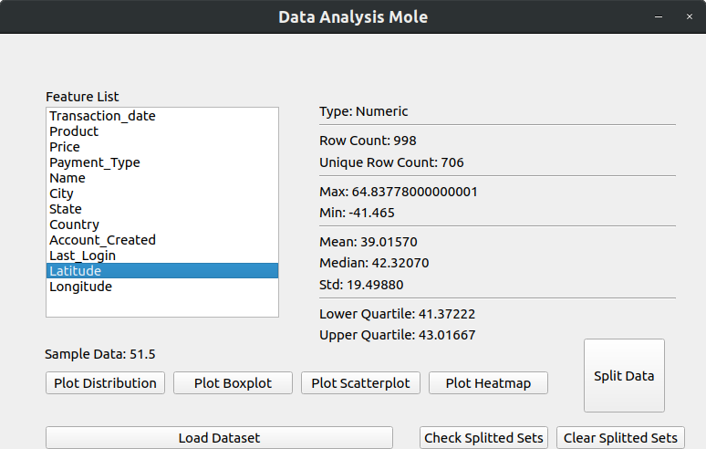
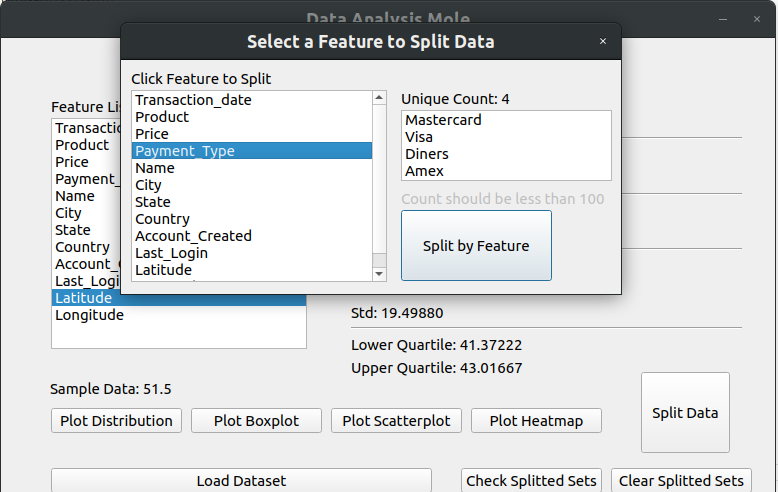
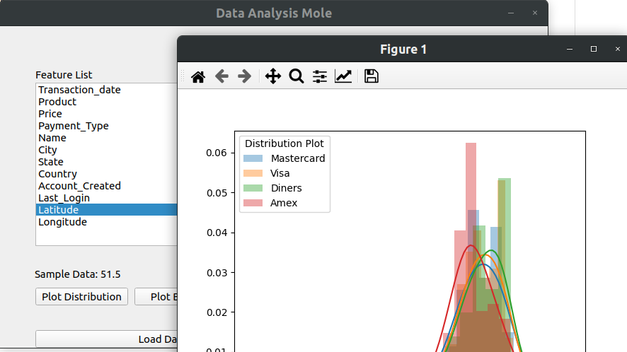
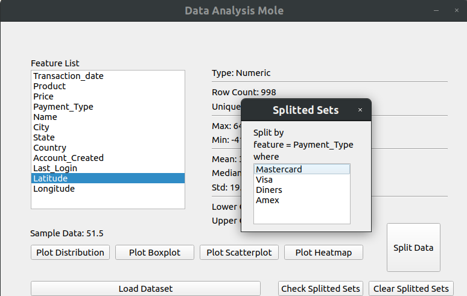

# Data-Analysis-Mole
A tool to show brief information about a data set and reduce writing code snippets to save time

<h2>The abilities that the app gives you</h2>
  1) Having a brief information about max, min, mean, median, standard deviation, quartiles etc. (numpy, pandas)
  2) Using different kind of plots to visualize the data (seaborn, matplotlib)
  3) Splitting data into subsets by a feature (you can use the plots with these subsets two make feature analysis)
 
<h2>Libraries used</h2>
  1) Pandas
  2) Numpy
  3) Seaborn
  4) Matplotlib
  5) PyQt5
  6) Pyinstaller (it may be unnecessary if you do not use the app as exe file)

<h2>How to use</h2>
You can easily run the main.py scripts as you run your any other python scripts and you can also use exe by building the app with pyinstaller package.

<h2>Screenshots</h2>
<h3>Main Frame</h3>

<h3>Splitting data into subsets</h3>

<h3>Using plots</h3>

<h3>Checking splitted subsets</h3>

